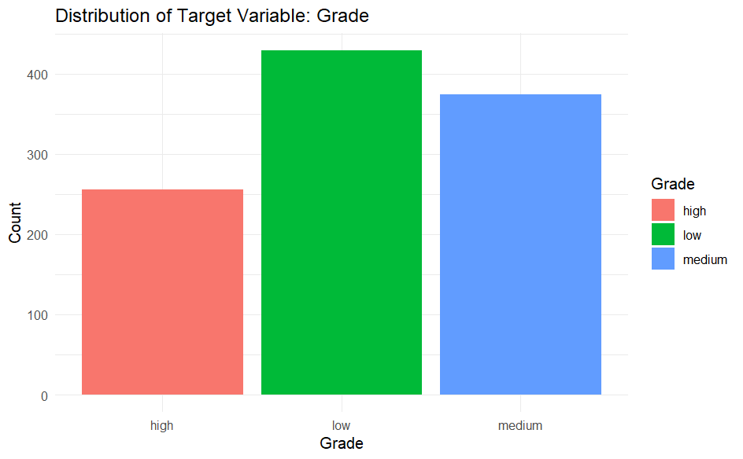
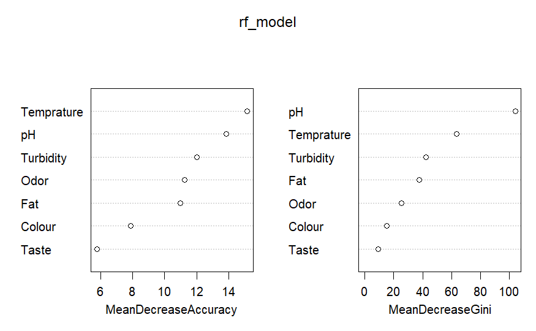
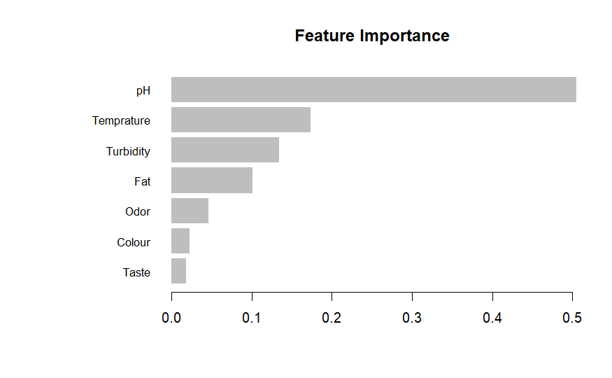

# Milk-Quality---ML
Predicting milk quality using three machine learning techniques (Multinomial Logistic Regression, Random Forest, and XGBoost) in R

# 🥛 Modeling Milk Quality Using Machine Learning Techniques

Milk is considered an important factor in human life. High quality milk should not contain any toxins. Otherwise, it will be a high risk to human health. This study aims to predict milk quality using three different supervised machine learning
methods. 
- **Multinomial logistic regression model** is used as the baseline model
- **Random Forest**
- **XGBoost**

Evaluate the performance of selected three models using different statistical evaluation metrics such as,
- Accuracy
- Recall
- Precision
- F1 score

## Dataset

- Features: pH, Temperature, Taste, Odor, Fat, Turbidity, Color
- Target: Milk Grade (Low, Medium, High)
- Observations: 1,059  
- Source: Kaggle 

## Methods

Implemented in **R**
Continuous variables (pH, Temperature) are scaled and the target variable Grade is encoded (low-1, medium-2, high-3).
There were several outlier for pH and Temperature variables and addressed them to minimize the effect for the models.
Train on 70% of data and evaluated on 30% test data.
Hyperparameter tuning was performed using **random search**.

## Results

The distribution of the target variable Grade seems like a relatively balanced dataset across the 3 categories.

  

The confusion matrix is constructed of these models. It highlights the model performance in predicting the target variable. 
The moltinomoal logistic regression model struggled to predict the ”low” class and miss classifying it as ”medium”, and the ”high” class miss-classifying as ”low”. 
The model Random Forest struggled to predict ”high” class and missclassifyingit as ”medium”.
The miss-classifying of XGBoosts model has reduced.

pH and Temperature variables are the most important features among the seven variables in the dataset, followed by Turbidity.

  

  

The performane of the three models are evaluated using different metrics and the result is presented in the below table.

| Model | Accuracy | Precision | Recall | F1 Score |
|--------|-----------|------------|----------|-----------|
| Logistic Regression | 83.86% | 83.32 | 83.46 | 83.37 |
| Random Forest | 91.45% | 92.72 | 88.34 | 89.23 |
| XGBoost | **98.73%** | **98.65** | **98.42** | **98.53** |

## Conclusion

The project aim was to predict milk quality using three different methods Multinomial Logistic Regression, Random Forest and XGBoosts. The data has seven independent variables and one target variable. There were no missing values and the target variable is well balanced.

The three methods demonstrated good results but there are several limitations. Fist, The dataset is small in terms of size and features. This may limit the optimization and also the generalizability. In future the study should use large data set to enhance model performance.

In conclusion, the Multinomial Logistic Regression model produced the lowest performance and the XGBoosts model displays good performance. XGBoost model is recommended for milk quality prediction in this study.

